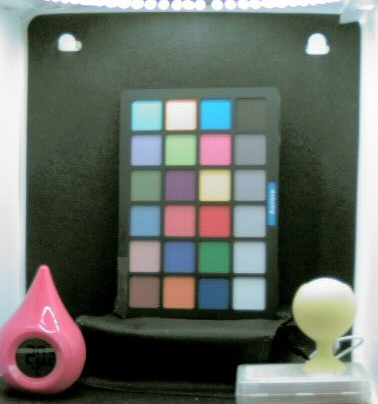
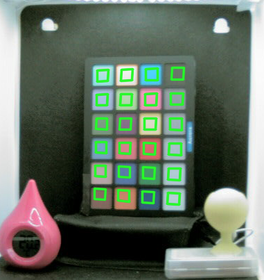
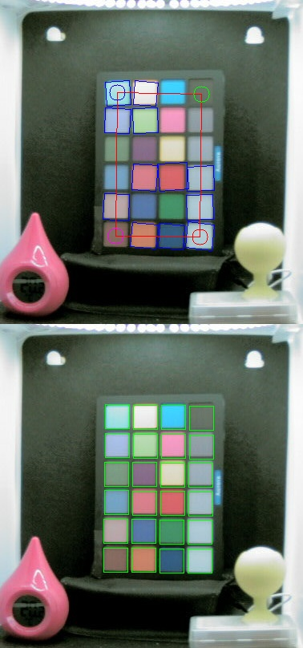
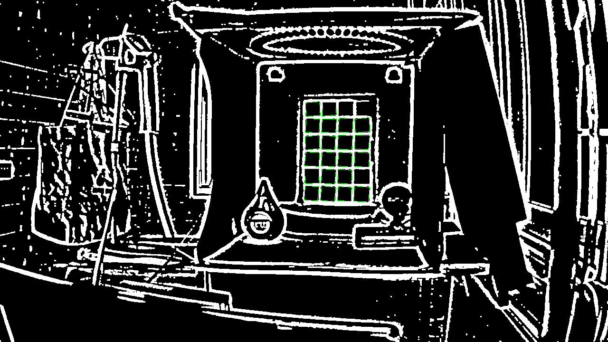
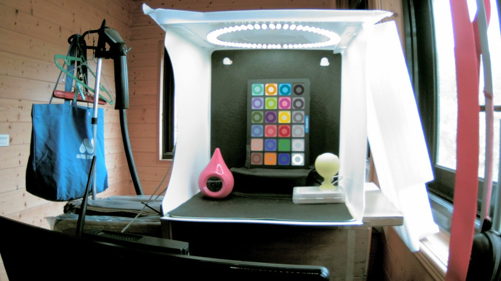

# QT_OpenCV4_ColorChecker     
 
### ColorChecker stuff w/ OpenCV4, QT5... 

Python project: forked from https://github.com/mathandy/python-macduff  
QT project: adapted from OpenCV doc website.  

 

### QT5/OpenCV4 ColorChecker finder...  
 
 

### OpenCV4 ColorChecker Python finder...  
   

 
 
 

## References  
   -[OpenCV4 ColorChecker Finder w/ Python](https://github.com/mathandy/python-macduff) Python CC finder...  
   -[OpenCV4 ColorChecker QT5 Detect](https://docs.opencv.org/master/d0/d81/tutorial_table_of_content_mcc.html) QT5 CC finder...    
