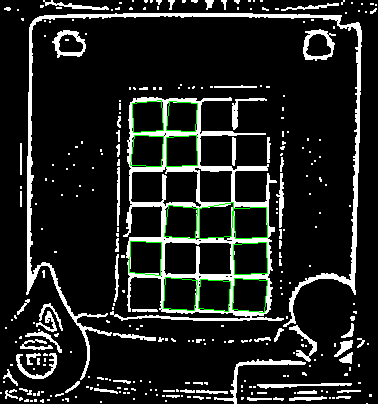

# QT_OpenCV4_ColorChecker     
 
### ColorChecker stuff w/ OpenCV4, QT5... 

Python project: forked from https://github.com/mathandy/python-macduff  
QT projects: adapted from OpenCV doc website, with OpenCV4 API. (https://github.com/jmysu/QT_OpenCV4_ColorChecker/tree/main/Source) 

 

### Simple QT5/OpenCV4 ColorChecker finder...  
 
 
 

### OpenCV4 ColorChecker Python finder...  
   
 
 

### Colors check: detected vs data! 
  
 

### Simple QT5/OpenCV4 Color Calibration w/ colorchecker 
   
 
 

### Simple QT5/OpenCV4 Checkboard finder
   
 
 

## References  
   -[OpenCV4 ColorChecker Finder w/ Python](https://github.com/mathandy/python-macduff) Python CC finder...  
   -[OpenCV4 ColorChecker Detect](https://docs.opencv.org/master/d0/d81/tutorial_table_of_content_mcc.html) QT5 CC finder...  
   -[OpenCV4 CCM](https://docs.opencv.org/4.5.1/d1/dc1/tutorial_ccm_color_correction_model.html) Color Correction Model...  
